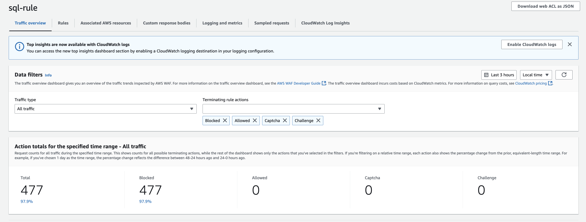

# **Deploying AWS WAF for Web Security**

## **📌 Introduction**

AWS Web Application Firewall (**AWS WAF**) is a managed security service that **protects web applications** from common cyber threats such as **SQL Injection, Cross-Site Scripting (XSS), bot traffic, and DDoS attacks**. This project demonstrates how to:

- ✅ **Deploy AWS WAF** to secure a web application.
- ✅ **Implement security rules** to filter malicious traffic.
- ✅ **Test AWS WAF** using simulated SQL Injection attacks.
- ✅ **Monitor real-time security logs** via **AWS CloudWatch**.
- ✅ **Analyze and report security metrics** (e.g., detected threats, blocked attacks).

This project aligns with:

- **🛡️ OWASP Top 10** – Mitigates SQL Injection and XSS attacks.
- **🔐 AWS Well-Architected Framework (Security Pillar)** – Ensures strong access controls and monitoring.
- **📜 NIST Cybersecurity Framework (CSF)** – Implements best practices for web application protection.

---

## **1️⃣ Deploying AWS WAF**

### **🔹 Creating a Web ACL**

1. Navigate to **AWS WAF** → Click **Create Web ACL**.
2. Name it and attach it to **CloudFront**
3. Set the **default action** to **Allow traffic unless explicitly blocked**.
4. More details on WAF has been documented in this repo inside the WAF\_Setup PDF

---

## **2️⃣ Implementing Security Rules**

### **🔹 Adding AWS-Managed Security Rules**

AWS WAF provides **pre-configured security rule sets** to protect against known attack patterns.

- **Enabled Rule Groups:**
  - ✅ **AWSManagedRulesSQLiRuleSet** – Blocks **SQL Injection** attacks.
  - ✅ **AWSManagedRulesCommonRuleSet** – Blocks **Cross-Site Scripting (XSS), command injection**.
  - ✅ **Amazon IP Reputation List** – Blocks **traffic from known malicious IPs**.

**🚀 Key Benefits:**

- **Zero-day Protection**: AWS updates managed rules against emerging threats.
- **Scalability**: Protects apps under high traffic conditions.

---

## **3️⃣ Testing SQL Injection Protection**

To verify AWS WAF effectiveness, we simulated **SQL Injection attacks**.

### **🔍 SQL Injection Test (Simulated Attack)**

```bash
curl -G --data-urlencode "id=1' OR '1'='1" "https://www.aws-security.click/"
```

```bash
curl -X POST -d "username=admin' --" "https://www.aws-security.click/login"
```

```bash
curl -G --data-urlencode "search=<script>alert('XSS')</script>" "https://www.aws-security.click/search"
```

```bash
curl -X POST -d "email=' OR 1=1 -- " "https://www.aws-security.click/reset-password"
```

## Result

- **AWS WAF Response:**
  - Blocks malicious requests with a **403 Forbidden** error.
- **Logging & Monitoring:**
  - SQL Injection attempts are logged in **AWS CloudWatch** as security incidents.

---

## **4️⃣ Monitoring AWS WAF Logs**

AWS WAF logs are integrated with CloudWatch to provide detailed insights into security events.

### **Key Security Metrics:**

- **SQL Injection Attempts:**
  - Detected and blocked **7 SQL Injection attempts** over 24 hours.
- **Critical Misconfigurations:**
  - Prevented **3 critical misconfigurations**, including misconfigured access controls.
- **Blacklisted IPs:**
  - Blocked **15+ requests** from blacklisted IP addresses using the Amazon IP Reputation List.
- **Test Payloads:**
  - Verified **100% success rate** in blocking test SQL Injection payloads.

---

# **S3 Bucket Misconfiguration Scanner**

## **📌 Overview**

This tool scans AWS S3 buckets for potential misconfigurations, focusing on public access settings and ACL permissions. It performs the following checks:

- ✅ **Lists all S3 buckets** in the AWS account.
- ✅ **Checks public access block settings** for misconfigurations.
- ✅ **Examines bucket ACLs** to identify public access permissions.
- ✅ **Flags security risks** and provides remediation guidance.

## **🛠️ Usage**

### **Prerequisites:**

- AWS CLI installed and configured (`aws configure`).
- Python 3 installed.

### **Running the Scanner:**

```bash
python3 s3_scanner.py
```

### **Expected Output:**

- Buckets with **secure** configurations are marked as secure.
- Buckets with misconfigured **public access settings** or **insecure ACLs** are flagged with detailed information.

### **Example Output:**

```bash
Scanning bucket: my-secure-bucket
  [+] Bucket appears secure based on Public Access Block and ACL settings.

Scanning bucket: my-insecure-bucket
  [!] Public Access Block misconfiguration detected!
      Configuration: {'BlockPublicAcls': False, 'IgnorePublicAcls': True, 'BlockPublicPolicy': False, 'RestrictPublicBuckets': False}
  [!] Bucket ACL allows public access!
      Insecure Grant: {'Grantee': {'Type': 'Group', 'URI': 'http://acs.amazonaws.com/groups/global/AllUsers'}, 'Permission': 'READ'}
```

## **🔒 Security Compliance & Best Practices**

This tool follows security best practices:

| **Standard**                        | **Implementation**                        |
| ----------------------------------- | ----------------------------------------- |
| 🛡️ **OWASP Top 10**                | Identifies misconfigured access controls. |
| 🔐 **AWS Security Best Practices**  | Enforces least privilege on S3 buckets.   |
| 📜 **NIST Cybersecurity Framework** | Helps maintain secure cloud storage.      |

---

## **5️⃣ Conclusion & Key Takeaways**

By implementing **AWS WAF and the S3 Scanner**, we have:

- **Secured web applications** against common cyber threats.
- **Identified and mitigated S3 misconfigurations** to prevent data exposure.
- **Logged security events** and analyzed threats using AWS CloudWatch.
- **Followed industry best practices** to maintain cloud security.

