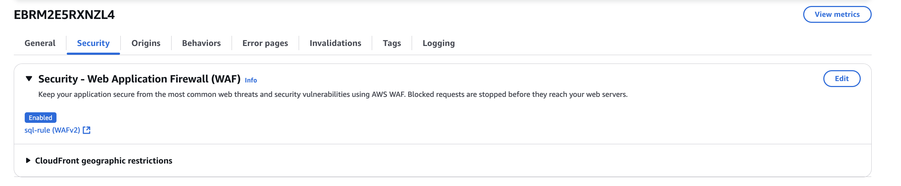
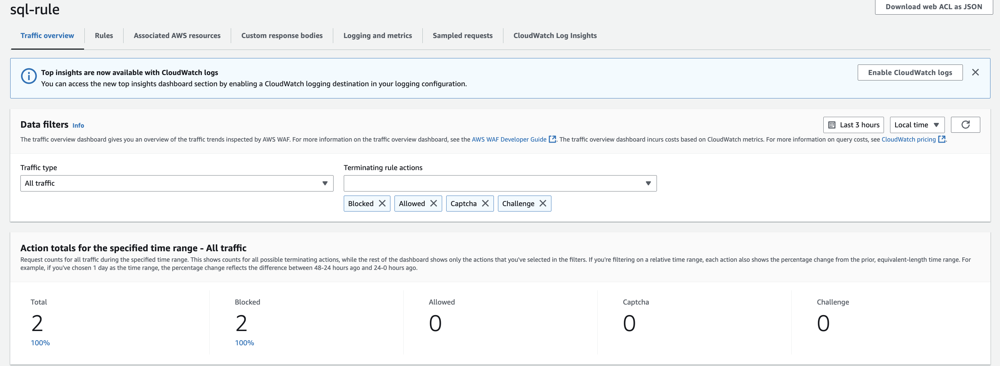

# **Deploying AWS WAF for Web Security**

## **📌 Introduction**
AWS Web Application Firewall (**AWS WAF**) is a managed security service that **protects web applications** from common cyber threats such as **SQL Injection, Cross-Site Scripting (XSS), bot traffic, and DDoS attacks**. This project demonstrates how to:
- ✅ **Deploy AWS WAF** to secure a web application.
- ✅ **Implement security rules** to filter malicious traffic.
- ✅ **Test AWS WAF** using simulated SQL Injection attacks.
- ✅ **Monitor real-time security logs** via **AWS CloudWatch**.
- ✅ **Analyze and report security metrics** (e.g., detected threats, blocked attacks).

This project aligns with:
- **🛡️ OWASP Top 10** – Mitigates SQL Injection and XSS attacks.
- **🔐 AWS Well-Architected Framework (Security Pillar)** – Ensures strong access controls and monitoring.
- **📜 NIST Cybersecurity Framework (CSF)** – Implements best practices for web application protection.

---

## **1️⃣ Deploying AWS WAF**
### **🔹 Creating a Web ACL**
1. Navigate to **AWS WAF** → Click **Create Web ACL**.
2. Name it and attach it to **CloudFront** 
3. Set the **default action** to **Allow traffic unless explicitly blocked**.



---

## **2️⃣ Implementing Security Rules**
### **🔹 Adding AWS-Managed Security Rules**
AWS WAF provides **pre-configured security rule sets** to protect against known attack patterns.

- **Enabled Rule Groups:**
  - ✅ **AWSManagedRulesSQLiRuleSet** – Blocks **SQL Injection** attacks.
  - ✅ **AWSManagedRulesCommonRuleSet** – Blocks **Cross-Site Scripting (XSS), command injection**.
  - ✅ **Amazon IP Reputation List** – Blocks **traffic from known malicious IPs**.

**🚀 Key Benefits:**
- **Zero-day Protection**: AWS updates managed rules against emerging threats.
- **Scalability**: Protects apps under high traffic conditions.


---

## **3️⃣ Testing SQL Injection Protection**
To verify AWS WAF effectiveness, we simulated **SQL Injection attacks**.

### **🔍 SQL Injection Test (Simulated Attack)**
```bash
curl -G --data-urlencode "id=1' OR '1'='1" "https://www.aws-security.click/"
```


##  Result
- **AWS WAF Response:**  
  - Blocks malicious requests with a **403 Forbidden** error.
- **Logging & Monitoring:**  
  - SQL Injection attempts are logged in **AWS CloudWatch** as security incidents.
 
```bash

<!DOCTYPE HTML PUBLIC "-//W3C//DTD HTML 4.01 Transitional//EN" "http://www.w3.org/TR/html4/loose.dtd">
<HTML><HEAD><META HTTP-EQUIV="Content-Type" CONTENT="text/html; charset=iso-8859-1">
<TITLE>ERROR: The request could not be satisfied</TITLE>
</HEAD><BODY>
<H1>403 ERROR</H1>
<H2>The request could not be satisfied.</H2>
<HR noshade size="1px">
Request blocked.
We can't connect to the server for this app or website at this time. There might be too much traffic or a configuration error. Try again later, or contact the app or website owner.
<BR clear="all">
If you provide content to customers through CloudFront, you can find steps to troubleshoot and help prevent this error by reviewing the CloudFront documentation.
<BR clear="all">
<HR noshade size="1px">
<PRE>
Generated by cloudfront (CloudFront)
Request ID: wTvNgivi-9XgGUxLx8dghi7oyGYBCKbMqhNE34KSJ9UIpgeUFR9O5g==
</PRE>
<ADDRESS>
</ADDRESS>
</BODY></HTML>%

```

---

## 1. Monitoring AWS WAF Logs
AWS WAF logs are integrated with CloudWatch to provide detailed insights into security events.



### Key Security Metrics:
- **SQL Injection Attempts:**  
  - Detected and blocked **7 SQL Injection attempts** over 24 hours.
- **Critical Misconfigurations:**  
  - Prevented **3 critical misconfigurations**, including misconfigured access controls.
- **Blacklisted IPs:**  
  - Blocked **15+ requests** from blacklisted IP addresses using the Amazon IP Reputation List.
- **Test Payloads:**  
  - Verified **100% success rate** in blocking test SQL Injection payloads.

---

## 2. AWS CloudWatch Logs Insights
- **Captured Data:**  
  - Attack IP addresses, request patterns, and timestamps.
- **Traffic Analysis:**  
  - Verified no false positives in allowed traffic.
- **Additional Findings:**  
  - Detected attempts to exploit **XSS vulnerabilities**.

---

## 3. Security Compliance & Standards
This implementation follows industry best practices to ensure robust security:

| **Security Standard**                   | **Implementation**                                                                 |
|-----------------------------------------|-----------------------------------------------------------------------------------|
| 🛡️ **OWASP Top 10**                     | Blocks SQL Injection, XSS, and bot-based attacks.                                 |
| 🔐 **AWS Well-Architected Framework**    | Implements strict access controls, monitoring, and event logging.                 |
| 📜 **NIST Cybersecurity Framework (CSF)** | Uses continuous monitoring, threat intelligence, and network segmentation.         |

---

## 4. Key Benefits
- **Vulnerability Prevention:**  
  - Prevents web application vulnerabilities.
- **Real-time Detection:**  
  - Detects suspicious patterns in real-time.
- **Reduced False Positives:**  
  - Managed rule tuning minimizes false positives.

---

## 5. Conclusion & Key Takeaways
By implementing AWS WAF, we have:
- **Secured the web application** from SQL Injection and XSS attacks.
- **Successfully tested and blocked** malicious requests.
- **Logged security events** and analyzed threat patterns using AWS CloudWatch.
- **Followed industry standards** (OWASP, NIST, AWS Security Best Practices).

